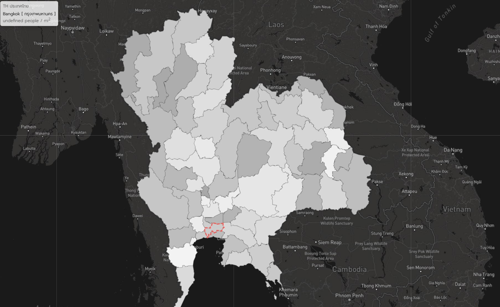

# ThailandGeoMap : Thailand Geography Map

This project was made to demonstrate an understanding of Mapbox, Leaflet, and Topojson together with Thailand shapefile by converting to the Topojson file before used.

### Prerequisites
The solution was built on Visual Studion 2019 by using a html file (country-th.html) on a Node.JS project.
* Express
* Jquery

## References
* [MapBox] https://www.mapbox.com/
* [Leaflet] https://leafletjs.com/examples.html